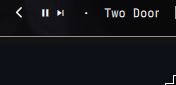
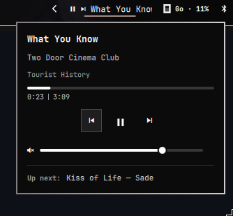

# Cliamp Now Playing

A bar widget for Omarchy that shows what [cliamp](https://cliamp.stream) is
playing, with playback controls.





## Features

- Fixed-width ticker that scrolls the current title · artist while playing
- Separate play/pause and next buttons, click the ticker for the popup panel
- Popup with progress + elapsed/duration, transport controls, volume slider,
  playback status, and an "Up next" line for the next track in the queue
- Hotkey/script IPC: `omarchy-shell cliamp status | playPause | next |
  previous | volume <dB> | panel`

## Install

```sh
omarchy plugin add https://github.com/yourname/omarchy-cliamp-nowplaying.git --enable
```

## Dependency (auto-installed)

The "Up next" line reads the queue through a small cliamp Lua plugin
(`cliamp/next-track.lua`). On first load the widget copies it to
`~/.config/cliamp/plugins/` and approves it with
`cliamp plugins trust next-track --yes` (read-only, declares **no
permissions**). Restart cliamp once after install to activate it. Without it
the widget still works — "Up next" simply stays hidden.

## Settings

```sh
omarchy bar set miguel.cliamp-nowplaying hideWhenStopped false   # keep visible when cliamp is off
omarchy bar set miguel.cliamp-nowplaying maxWidth 120            # ticker width in px
```

## Keybindings

Bind whatever you like to these shell IPC calls:

```sh
omarchy-shell cliamp playPause
omarchy-shell cliamp next
omarchy-shell cliamp volume -12
```

## Remove

```sh
omarchy plugin remove miguel.cliamp-nowplaying
```

To also remove the companion cliamp plugin:
`rm ~/.config/cliamp/plugins/next-track.lua` (and its entry in
`~/.config/cliamp/plugins/.trust.json`).
